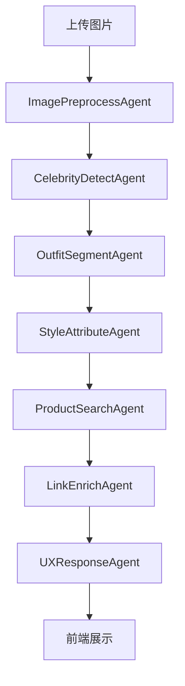
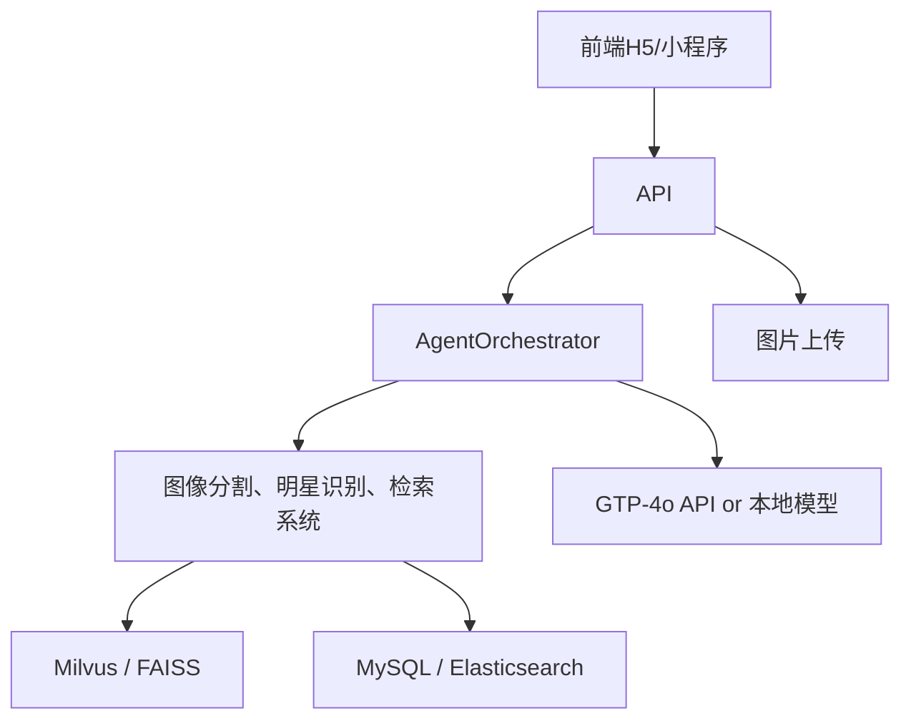

你提的需求是构建一个面向**电商时尚领域的拍照识别推荐系统**，可以拍照识别明星穿搭并匹配类似/相同款式商品，并提供购买链接。这个系统涉及图像识别、商品检索、大模型智能体构建、多端协同等复杂环节。

---

我将从 **产品定义、AI智能体构建、数据结构、大模型选型、存储架构、并发支持、前后端架构、模型部署、运营策略** 等模块给出一个完整可落地的方案。

---

## 🧠 一、产品定位与用户流程

### 1. 产品功能定位

| 模块     | 说明                  |
| ------ | ------------------- |
| 拍照识别   | 用户拍摄或上传图片，系统识别穿搭    |
| 明星识别   | 判断图片中的人物是否为某位明星     |
| 衣服款式识别 | 拆解图像，分割上衣、裤子、鞋子、配饰等 |
| 商品推荐   | 基于识别结果匹配电商平台同款或相似款  |
| 购买链接跳转 | 跳转到淘宝、京东、小红书、抖音等购买页 |
| 历史记录   | 查看用户历史识别记录和购买记录     |

### 2. 用户流程（前端UI体验）

```
拍照/上传 -> 图像识别 -> 明星匹配（可选） -> 衣服拆解 -> 商品推荐列表 -> 点击跳转购买
```

---

## 🧠 二、AI智能体构建设计

### 1. Agent 拆分（LangGraph / LangChain 多智能体架构）

| Agent 名称             | 功能说明               |
| -------------------- | ------------------ |
| ImagePreprocessAgent | 图像预处理，压缩、裁剪、背景去除   |
| CelebrityDetectAgent | 明星识别（可选）           |
| OutfitSegmentAgent   | 衣服区域分割，如上衣、裤子、鞋子   |
| StyleAttributeAgent  | 款式、颜色、风格、纹理属性识别    |
| ProductSearchAgent   | 相似商品检索（向量匹配/关键词匹配） |
| LinkEnrichAgent      | 增强商品链接、拼接跳转信息等     |
| UXResponseAgent      | 生成用户可视化推荐列表        |

### 2. 工作流组装（LangGraph Graph）



---

## 🗂️ 三、核心数据结构设计

### 1. 用户上传数据（图片 + 元数据）

```json
{
  "user_id": "0x123abc",
  "image_url": "https://cdn.example.com/uploads/xxx.jpg",
  "timestamp": "2025-06-06T12:00:00Z",
  "source": "upload|camera"
}
```

### 2. 拆解后的图像结构

```json
{
  "celebrity_name": "Lisa",
  "segments": [
    {
      "category": "top",
      "color": "white",
      "style": "off-shoulder",
      "image_crop_url": "...",
      "embedding": [0.11, 0.43, ...]
    },
    ...
  ]
}
```

### 3. 商品推荐结果

```json
{
  "segment_category": "top",
  "recommendations": [
    {
      "title": "同款白色露肩T恤",
      "price": "199.00",
      "platform": "Taobao",
      "link": "https://taobao.com/xxx",
      "image": "https://cdn.xxx.com/1.jpg"
    },
    ...
  ]
}
```

---

## 🔍 四、大模型与算法模块选择

### 1. 图像识别模块（可选开源模型）

| 模块   | 推荐模型                                                |
| ---- | --------------------------------------------------- |
| 明星检测 | \[FaceNet + Celebrity DB] or \[InsightFace + 自建明星库] |
| 衣服分割 | \[ClothesNet], \[Mask R-CNN + DeepFashion2]         |
| 属性识别 | \[FashionCLIP], \[BLIP2 + caption]                  |
| 相似搜索 | FAISS / Milvus + FashionCLIP 向量                     |

### 2. 智能Agent逻辑建模

用 OpenAI GPT-4o / Claude / InternLM2 搭配工具（Tool Calling）+ LangGraph + LangChain + 检索增强生成（RAG）：

* Prompt工程：不同Agent独立Prompt模板
* Tool调用：商品搜索接口、图片分割、明星识别等封装成工具
* Agent Chain：LangGraph连接工具与智能体执行流程

---

## 🛠️ 五、系统架构设计（从前端到大模型）

### 架构总览图



### 技术选型建议

| 模块     | 技术                                |
| ------ | --------------------------------- |
| 前端     | React + Taro.js（多端）               |
| 后端     | FastAPI / SpringBoot（根据团队栈）       |
| 向量搜索   | Milvus + FashionCLIP 向量           |
| 数据库    | MySQL + Redis（缓存）                 |
| 存储     | OSS/S3 图片存储 + CDN                 |
| AI模型部署 | HuggingFace + VLLM / TritonServer |
| 大模型    | OpenAI GPT-4o 或 InternLM2 + RAG   |
| 图像识别   | Segment Anything, DeepFashion2    |
| 并发调度   | Celery + RabbitMQ 或 K8s CronJob   |
| 服务编排   | LangGraph (多Agent协调)              |

---

## 📦 六、数据存储设计

### 1. 用户数据表（MySQL）

```sql
CREATE TABLE user (
  id BIGINT PRIMARY KEY,
  wallet_address VARCHAR(64),
  created_at DATETIME
);
```

### 2. 上传图片识别任务表

```sql
CREATE TABLE image_task (
  id BIGINT PRIMARY KEY,
  user_id BIGINT,
  image_url TEXT,
  status ENUM('pending', 'processing', 'done'),
  created_at DATETIME
);
```

### 3. 商品库（可对接平台或自建）

* 同步淘宝/京东 API 数据到商品库
* 使用商品标题 + 图像抽Embedding存入 Milvus 向量库

---

## 💡 七、运营增长策略建议

### 1. 渠道引流

* 小红书/抖音挂拍测评
* 微信小程序推送 + H5分享页面
* 与明星粉丝圈/饭圈合作引流

### 2. 用户留存策略

* 历史穿搭记录保存
* 收藏夹、关注穿搭风格推荐
* 签到得积分兑换优惠券（可导流到电商平台）

### 3. 数据闭环

* 用户识别结果反馈是否满意（训练数据）
* 自动收集淘宝小红书爆款穿搭补充识别库

---

## 📈 八、并发性能与可扩展性设计

| 模块     | 说明                               |
| ------ | -------------------------------- |
| 请求入口限流 | Nginx + Lua限流或 API Gateway QPS控制 |
| 后端并发   | FastAPI + Uvicorn + Gunicorn 多进程 |
| 任务分发   | Celery + Redis 队列                |
| 图片识别   | 模型推理服务做异步拆分                      |
| 模型部署   | Triton/VLLM 支持批量推理、GPU隔离         |
| 向量库并发  | Milvus 分片部署                      |
| 缓存策略   | 商品搜索结果缓存 5-10分钟（热点高）             |

---

## ✅ 总结一句话

> 这是一个结合图像识别 + 多智能体协调 + 电商推荐的大模型应用系统，可以通过 LangGraph 多智能体流程、图像分割模型和向量商品匹配技术，实现从拍照到推荐的完整体验闭环。

---

